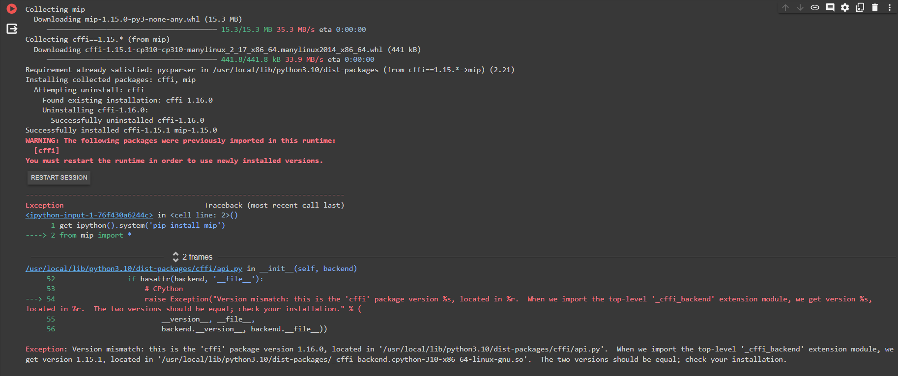

To install [Python-MIP](https://www.python-mip.com/), use the command `pip install mip`. 

For usage in [Google Colab](https://colab.google/), add the following code snippet:

```
!pip install mip
from mip import *
```

If you encounter the error shown in the image below during the installation, restart the Colab session and then re-run the cell with the installation command. This should properly install the package.



Find more information about the installation process in the [Python-MIP documentation](https://python-mip.readthedocs.io/en/latest/install.html). 