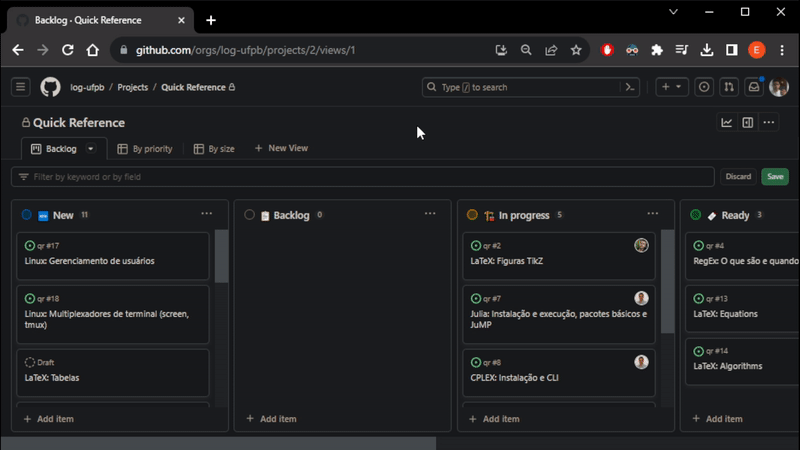
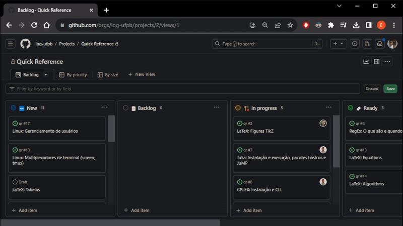
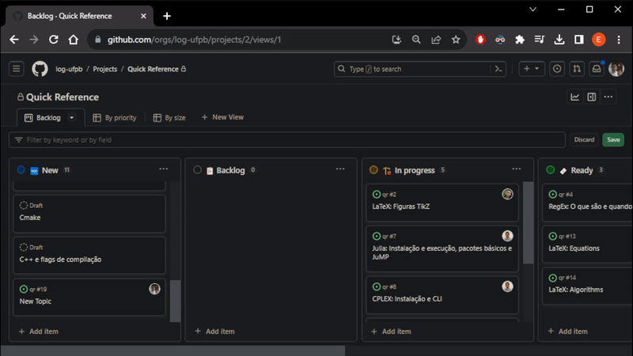

<div align="center">
    
    <h1><a href="https://github.com/log-ufpb/qr/wiki">Quick Reference</a></h1>
</div>

This repository provides useful information gathered by researchers of the Logistics and Optimization Group of the Universidade Federal da Paraíba (LOG-UFPB).

Please refer to the [Wiki](https://github.com/log-ufpb/qr/wiki) for more details.

# How to Contribute

## Choosing a topic
From the [backlog of the project](https://github.com/orgs/log-ufpb/projects/2), you can see all topics of contents that are relevant to the Wiki and its progress. Select the topic that you wish to contribute by converting it to an issue and assigning it to yourself. If you have ideas for new contents, you can suggest them as issues or add new drafts on the backlog first. Then, move it to the "In progress" column and start contributing.

## Submitting new content
The Wiki is a sub-repository within the _quick reference_ (QR) repository. To add contents from the QR repository, you can create and edit Markdown files in the `/docs` folder. These files will automatically become Wiki pages by the `publish_wiki` workflow. Note that any modifications outside of this folder are ignored when committed. Submit content for a group of related topics or a single topic following the steps bellow.

First, clone the repository locally:
```bash
    git clone https://github.com/log-ufpb/qr.git
```
Then, create and switch to a branch for the new content:
```bash
    git checkout -b new_branch_name
```
Add the contents of the topics you've chosen and commit the changes with a meaningful message:
```bash
    git commit -am "Add content for [Topics]"
```
When you're finished, push the commits remotely to a new branch of the QR with:
```bash
    git push origin new_branch_name
```
Finally, open a _pull request_ (PR) of the new branch to the main branch and mention the topics related to that PR. Move the topics from the "In progress" column to the "Ready" column in the [backlog of the project](https://github.com/orgs/log-ufpb/projects/2) and wait for a review. If your review is approved, please notify [@yurerocha](https://github.com/yurerocha) on the PR to request the merge. If you'd like to preview how the pages will look on the Wiki beforehand, push these changes to a forked repository of the QR.

## Reviewing new content
From the [backlog of the project](https://github.com/orgs/log-ufpb/projects/2), you can find topics ready for review in the "Ready" column. To review a topic, assign it to yourself and move it to the "In review" column. Review the associated pull requests and provide feedback. Once you've approved the changes, please notify [@yurerocha](https://github.com/yurerocha) on the PRs to request the merge and move the topics to the "Done" column.

## Tips and Tools

### Markdown All in One
For an enhanced Markdown editing experience, we recommend using the [Markdown All in One](https://marketplace.visualstudio.com/items?itemName=yzhang.markdown-all-in-one) extension available for Visual Studio Code (VSCode). It provides features such as table formatting, table of contents generation, and more, making your Markdown editing and contributions to the Wiki even more efficient.

### Branch-Topic relationship
When creating a new branch, it is best not to add content for different topics that are unrelated to each other. Instead, create a new branch for each set of topics. Creating separate branches for different topics or sets of related topics is essential for maintaining organization and clarity in the contribution process. It helps prevent conflicts, allows for easier tracking of changes, and ensures that each topic's changes are isolated.

### Using GitHub features
Creating a draft:


Converting it to an issue:



Assigning it to yourself:



Moving topics through columns:



