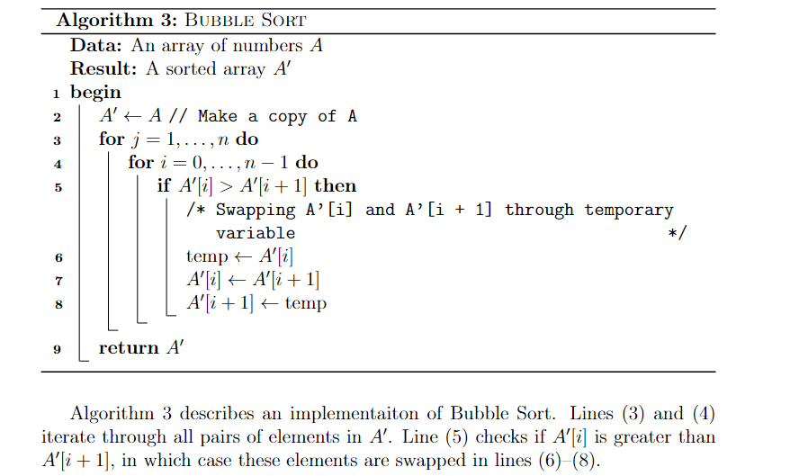
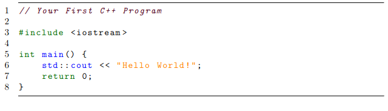

The use of algorithms for problem solving is almost mandatory in the field of optimization. Algorithms describe the sequence of step one must take to solve a problem, and as such, the way they are presented in scientific writing can highly impact understanding. Fortunately, LaTeX provides routines for neatly presenting both pseudocode and actual code. For instance, many packages allow writing pseudocode through the [`algorithm`](https://www.overleaf.com/learn/latex/Algorithms) environment. For snippets of code in real programming languages, one may resort to [`minted`](https://pt.overleaf.com/learn/latex/Code_Highlighting_with_minted) or [`verbatim` and `listings`](https://pt.overleaf.com/learn/latex/Code_listing).

## Pseudocode
Package [`algorithm2e`](https://www.overleaf.com/learn/latex/Algorithms#The_algorithm2e_package) is frequently used for pseudocode. It is straightforward to use for programmers, as it resembles real code. It is also highly customizable and flexible. In the example below, the flags `vlined` and `linesnumbered` were used to add vertical lines and line numbering. As with equations, the `label` command can be used to assign labels to each line, so they can be referenced later in the text. It is also possible to use the `tcc` and `tcp` commands to add comments to the pseudocode.

```latex
\usepackage{mathtools}
\usepackage[ruled, vlined, linesnumbered, english, onelanguage]{algorithm2e}

...

\begin{algorithm}[ht]
\DontPrintSemicolon
\KwData{An array of numbers $A$}
\KwResult{A sorted array $A'$}
\Begin{
    $A' \gets A$ \tcp{Make a copy of A}
    \For{$j = 1,\dots,n$}{  \label{line:bubblefor1} 
        \For{$i=0,\dots,n-1$} 
        { \label{line:bubblefor2}
            \If{$A'[i] > A'[i+1]$}{ \label{line:bubbleif}
                \tcc{Swapping A'[i] and A'[i + 1] through temporary variable}
                $\text{temp} \gets A'[i]$ \label{line:swap1} \;
                $A'[i] \gets A'[i+1]$  \;
                $A'[i+1] \gets \text{temp} $ \label{line:swap2} \;
            }
        }
    }
    \Return{$A'$}
}
\caption{\textsc{Bubble Sort}\label{alg:bubblesort}}
\end{algorithm}

Algorithm \ref{alg:bubblesort} describes an implementaiton of Bubble Sort. 
Lines \eqref{line:bubblefor1} and \eqref{line:bubblefor2} iterate through all pairs of elements in $A'$. 
Line \eqref{line:bubbleif} checks if $A'[i]$ is greater than $A'[i+1]$, in which case these elements are swapped in lines \eqref{line:swap1}--\eqref{line:swap2}.
```


In case multiple procedures or functions are used and defined in the same pseudocode, use the `\SetFwFunction` and `\SetKwProg` commands. The former creates a macro for a function that may be called multiple times through the code. The latter is used if one wishes to create a block of code for each procedure. Both commands were used in the following snippet.

```latex
\begin{algorithm}[ht]
\DontPrintSemicolon
\KwData{A graph $G$, weight function $w$ and source $s$}
\KwResult{Predecessors $v.\pi$ for each $v \in G.V$ }
    \SetKwFunction{FDijkstra}{\textsc{Dijkstra}}
    \SetKwFunction{FExtract}{\textsc{Extract-Min}}
    \SetKwFunction{FRelax}{\textsc{Relax}}
    \SetKwFunction{FInit}{\textsc{Initialize-Single-Source}}
    \SetKwProg{Proc}{Procedure}{ is}{end}
    \Proc{\FDijkstra{$G, w, s$}}{
        \FInit{$G,s$} \;
        $S \gets \emptyset $ \;
        $Q \gets G.V $ \;
        \While{$Q \neq \emptyset$}{
            $u \gets \FExtract$ \;
            $S \gets S \cup \{u\}$ \;
            \For{each vertex $v \in G.Adj[u]$}{
                \FRelax{$u,v,w$}
            }
        }
    }
    \Proc{\FRelax{$u,v,w$}}{
        \If{$v.d > u.d + w(u,v)$}{
        $v.d \gets u.d + w(u,v)$ \;
        $v.\pi \gets u$
        }
    }
\caption{\textsc{Dijkstra}\label{alg:dijkstra}}
\end{algorithm}
```


## Real code

When it comes to showing real code within the text, the `listings` package is highly recommended, as it works quite well with most programming languages. One may also specify settings such as font size, background colors and framing as they wish. These settings can then be grouped into a "style" so they can be reused throughout the text, as shown below with the `cplusplusListStyle`.

```latex
\usepackage{listings}
\usepackage[scaled=0.9]{DejaVuSansMono}
\lstdefinestyle{cplusplusListStyle}{
  belowcaptionskip=1\baselineskip,
  breaklines=true,
  xleftmargin=\parindent,
  language=C++,
  frame=tb,
  showstringspaces=false,
  tabsize=2,
  %basicstyle=\footnotesize,
  basicstyle=\footnotesize\ttfamily,
  keywordstyle=\bfseries\color{green!40!black},
  commentstyle=\itshape\color{purple!40!black},
  identifierstyle=\color{blue},
  stringstyle=\color{orange},
numbers=left,
stepnumber=1
}

% ...

\begin{lstlisting}[style=cplusplusListStyle] 
// Your First C++ Program

#include <iostream>

int main() {
    std::cout << "Hello World!";
    return 0;
}
\end{lstlisting}
```


For more minimalist (no syntax highlighting) and simple snippets of code, try the [`verbatim`]([https://www.overleaf.com/learn/latex/Code_Highlighting_with_minted](https://pt.overleaf.com/learn/latex/Code_listing#The_verbatim_environment)) environment. For an alternative to `listings`, try [`minted`](https://pt.overleaf.com/learn/latex/Code_Highlighting_with_minted), which works pretty similarly. Unlike `listings`, however, the `minted` package contains ready-made syntax highlighting for most famous programming languages.
