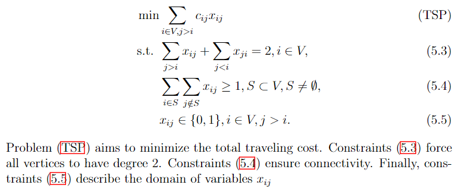
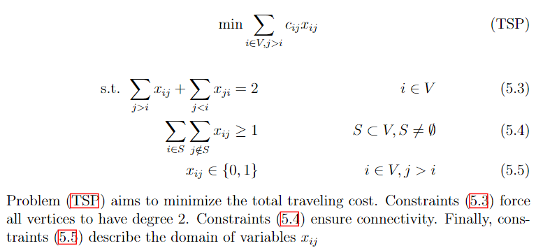
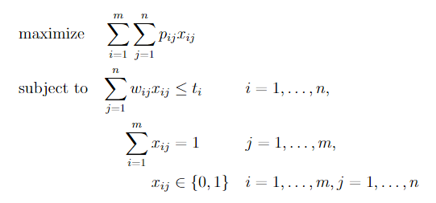

Being able to write mathematical expressions with plain text is one of LateX's greatest features, and makes it well-suited for scientific writing. For instance, adding
```latex
$S = \sum_{i=1}^{m} \left( \sum_{j=1}^{n} \alpha^k x_k + \frac{\log{i}}{i} \right) $
```
to a plain LaTeX file yields the expression $$S = \sum_{i=1}^{m} \left( \sum_{j=1}^{n} \alpha^k x_k + \frac{\log{i}}{i} \right). $$ Frequently used mathematical objects (e.g., matrices, vectors, sets, piecewise functions) can be easily written likewise. 

For an overall introduction to latex math, refer to [Overleaf guides](https://www.overleaf.com/learn/latex/Mathematical_expressions). 

## Mathematical formulations

Mathematical formulations are commonly used to solve optimization problems. As such, one is often faced with the task to cleanly present them in scientific reports. Many times, a mathematical formulation can be seen as a collection of equations, inequations and expressions that are deeply related. Therefore, care must be taken to correctly organize and align such expressions, so they are presented in an easy to follow fashion. 

The following example shows how one may write a formulation for the Traveling Salesman Problem in LaTeX. A label can be assigned to each equation with the `\label{}` command. Labeled equations can be referenced later in the text by using the `\eqref{}` command. By default, equations are automatically numbered. Alternatively, the `\tag{}` command can be used to assign a custom name to an equation instead of a number.  All references to an equation will work as a hyperlink if the package `hyperref` is imported.

```latex
\begin{align}
	\min & \sum_{i \in V, j > i} c_{ij} x_{ij}  \tag{TSP}\label{eq:probTSP} \\
	\text{s.t. } & \sum_{j>i} x_{ij} + \sum_{j<i} x_{ji} = 2, i \in V, \label{eq:degreeConstraintsTSP} \\
	& \sum_{i \in S}\sum_{j \notin S} x_{ij} \geq 1, S \subset V, S \neq \emptyset, \label{eq:subtourConstraintsTSP} \\
	& x_{ij} \in \{0,1\}, i \in V, j > i. \label{eq:integralityConstraintsTSP}
\end{align}
Problem \eqref{eq:probTSP} aims to minimize the total traveling cost. 
Constraints \eqref{eq:degreeConstraintsTSP} force all vertices to have degree 2. 
Constraints \eqref{eq:subtourConstraintsTSP} ensure connectivity. 
Finally, constraints \eqref{eq:integralityConstraintsTSP} describe the domain of variables $x_{ij}$
```




Much of how formulations are actually structured is subject to one's liking. In the previous example, the `&` operator was used to [align equations](https://www.overleaf.com/learn/latex/Aligning_equations_with_amsmath) to the left. The following snippet shows an alternative way to present the same formulation, in such a way that expressions are more evenly distributed, and the objective function is centered. 

```latex
 \begin{align}
    \text{min} \sum_{i \in V, j > i} c_{ij} x_{ij}  \tag{TSP}\label{eq:probTSP}
 \end{align}
\begin{align}
	\text{s.t. } \sum_{j>i} x_{ij} + \sum_{j<i} x_{ji} = 2 & & i \in V \label{eq:degreeConstraintsTSP} \\
	 \sum_{i \in S}\sum_{j \notin S} x_{ij} \geq 1 & & S \subset V, S \neq \emptyset \label{eq:subtourConstraintsTSP} \\
	 x_{ij} \in \{0,1\} & & i \in V, j > i \label{eq:integralityConstraintsTSP}
\end{align}
Problem \eqref{eq:probTSP} aims to minimize the total traveling cost. 
Constraints \eqref{eq:degreeConstraintsTSP} force all vertices to have degree 2. 
Constraints \eqref{eq:subtourConstraintsTSP} ensure connectivity. 
Finally, constraints \eqref{eq:integralityConstraintsTSP} describe the domain of variables $x_{ij}$
```



Further yet, one may opt to use specialized packages. One such package is `optidef`, which allows us to write the formulation for optimization problems as in the example below. However, mastering default commands such as `align{}` and `equation{}` is highly recommended, as they give us much more control.

```latex
\usepackage{optidef}

...

\begin{maxi}
    {}{\sum_{i=1}^{m}\sum_{j=1}^{n}p_{ij}x_{ij}}
    {}{}
    \addConstraint{\sum_{j=1}^n w_{ij} x_{ij}} {\leq t_i}{\quad i=1,\dots,n}
    \addConstraint{\sum_{i=1}^m x_{ij}} {= 1}{\quad j=1,\dots,m}
    \addConstraint{x_{ij}} {\in \{0,1\}} {\quad i=1,\dots,m,j=1,\dots,n}
\end{maxi}
```



## Tips
* If your equation is too big and doesn't fit the line width, split it with [`split{}`](https://tex.stackexchange.com/questions/358608/split-equations-inside-the-align-environment). You can also try `multline{}`.
* If you are running out of pages, try to reduce equation font size by using smaller fonts (e.g., `\scriptsize`, `\footnotesize`), or by using `scalebox{}`, as in [this answer](https://tex.stackexchange.com/questions/60453/reducing-font-size-in-equation).
* Parenthesis (`()`) have fixed size. For automatic scaling, use [`\left(` and `\right)`](https://www.overleaf.com/learn/latex/Brackets_and_Parentheses). The same applies to brackets, braces, ceil, floor, absolute value, etc.
* If there is a variable in your paper whose name you have not yet decided, consider using [`\newcommand`](https://francopasut.medium.com/latex-create-and-use-variable-names-6dedaa753bc1) as a placeholder so you can decide it later.
* [This document](http://am121.seas.harvard.edu/site/wp-content/uploads/2014/08/latex_snippets.pdf) contains several LaTeX snippets that pertain to mathematical programming.
